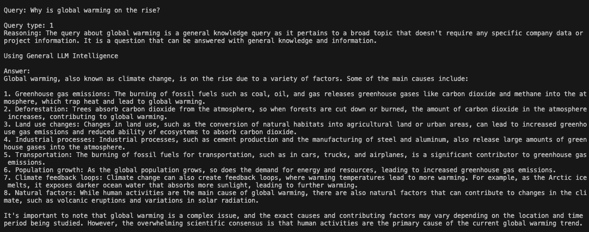
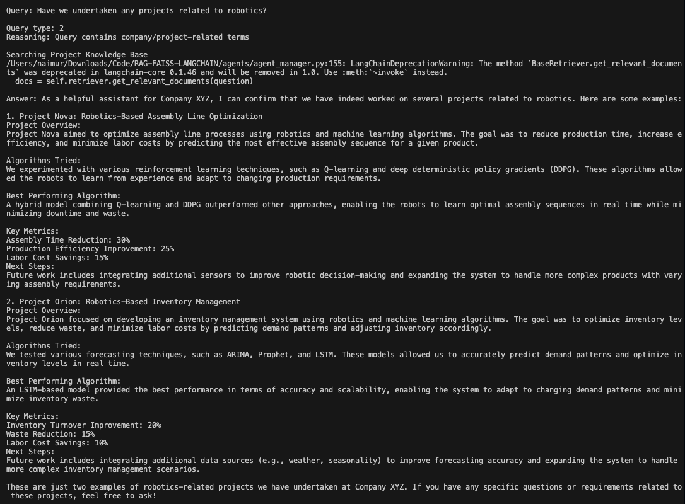
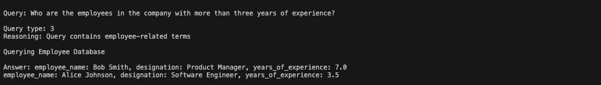

# RAG-FAISS-LANGCHAIN: Intelligent Query Processing System

A modular Python application that combines Retrieval-Augmented Generation (RAG), FAISS vector storage, and LangChain for intelligent query processing across multiple data sources.


## 🌟 Features

- **Multi-Modal Query Processing**: Handles three types of queries:
  - General Knowledge Queries
  - Project-Specific Queries (using RAG)
  - Employee Database Queries (using SQL)

- **Intelligent Query Classification**: Automatically categorizes queries using LLM
- **Vector-Based Knowledge Retrieval**: Uses FAISS for efficient similarity search
- **Modular Architecture**: Clean separation of concerns with dedicated modules

## 🏗️ Architecture

The system is built with a modular architecture consisting of:

```
RAG-FAISS-LANGCHAIN/
├── agents/                 # Query processing agents
│   ├── __init__.py
│   └── agent_manager.py    # Contains QueryClassifier, SQLAgent, RAGAgent
├── config/                 # Configuration management
│   ├── __init__.py
│   └── config.py          # Central configuration settings
├── database/              # Database operations
│   ├── __init__.py
│   └── db_manager.py      # SQLite database management
├── embeddings/            # Vector embeddings
│   ├── __init__.py
│   └── embeddings_manager.py  # FAISS and embeddings handling
├── knowledge-base/        # Knowledge storage
│   └── Projects.txt       # Project documentation
├── main.py               # Application entry point
└── requirements.txt      # Project dependencies
```

## 🚀 Getting Started

### Prerequisites

- Python 3.9+
- pip3
- Virtual environment (recommended)

### Installation

1. Clone the repository:
```bash
git clone [repository-url]
cd RAG-FAISS-LANGCHAIN
```

2. Create and activate a virtual environment:
```bash
python3 -m venv venv
source venv/bin/activate  # On Windows: venv\Scripts\activate
```

3. Install dependencies:
```bash
pip3 install -r requirements.txt
```

## 💡 Usage

Run the main application:
```bash
python3 main.py
```

Our system handles three types of queries, each processed by specialized agents:

### 1. General Knowledge Queries

*Example of a general knowledge query being processed by the system*

### 2. Project-Related Queries

*Example of a project-specific query using RAG for context-aware responses*

### 3. Employee Database Queries

*Example of an employee-related query using SQL conversion*

Example queries:
```python
# General Knowledge Query
"Why is global warming on the rise?"

# Project Query
"Have we undertaken any projects related to robotics?"

# Employee Query
"Who are the employees with more than three years of experience?"
```

## 🛠️ Configuration

Key configuration settings in `config/config.py`:

```python
# LLM Settings
model_name: str = "llama2"
temperature: float = 0

# Embedding Settings (see Hugging Face Integration section for more options)
embedding_model: str = "sentence-transformers/all-MiniLM-L6-v2"
device: str = "cuda" if torch.cuda.is_available() else "cpu"  # Optional GPU support

# FAISS Settings
retriever_k: int = 5      # Number of documents to retrieve
retriever_fetch_k: int = 8  # Number of documents to fetch before filtering

# See the Hugging Face Integration section for advanced configuration options
```

For detailed model configurations and troubleshooting, refer to the [Hugging Face Integration](#-hugging-face-integration) section above.

## 🔗 LangChain Integration

This project leverages LangChain's powerful components and abstractions:

### Core LangChain Components Used

1. **LLM Integration**
```python
from langchain_ollama import OllamaLLM
llm = OllamaLLM(model="llama2", temperature=0)
```

2. **Retrieval Components**
```python
from langchain.chains import RetrievalQA
from langchain_community.vectorstores import FAISS
```

3. **Prompt Management**
```python
from langchain.prompts import PromptTemplate
```

### LangChain Chains & Patterns

1. **RetrievalQA Chain**
- Combines document retrieval with LLM for question answering
- Uses FAISS for efficient similarity search
- Custom prompt templates for consistent responses

2. **Custom Chain Components**
- Specialized agents for different query types
- Modular design following LangChain patterns
- Extensible architecture for new capabilities

### Query Processing Pipeline

1. Query Classification using LLM
2. Routing to appropriate agent
3. Document retrieval (if needed)
4. Response generation and formatting

## 🤖 Intelligent Agents

Our system employs multiple specialized agents, each handling specific types of queries:

### 1. Query Classifier Agent
- **Purpose**: Routes queries to appropriate processing agents
- **Capabilities**:
  - Identifies query type (General, Project, Employee)
  - Uses LLM for classification
  - Handles edge cases and ambiguous queries
- **Implementation**:
  ```python
  class QueryClassifier:
      def classify_query(self, query):
          # Intelligent query classification
  ```

### 2. RAG Agent (Retrieval-Augmented Generation)
- **Purpose**: Handles project-related queries
- **Capabilities**:
  - Document retrieval using FAISS
  - Context-aware response generation
  - Structured response formatting
- **Key Features**:
  - Uses custom prompt templates
  - Handles multiple document contexts
  - Performance metrics tracking

### 3. SQL Agent
- **Purpose**: Database query generation and execution
- **Capabilities**:
  - Natural language to SQL conversion
  - Query optimization
  - Result formatting and presentation
- **Features**:
  - Schema-aware query generation
  - Error handling and validation
  - Rich response formatting

### 4. General Knowledge Agent
- **Purpose**: Handles general knowledge queries
- **Capabilities**:
  - Direct LLM interaction
  - Fact-based response generation
- **Features**:
  - No context dependency
  - Broad knowledge base access

### Agent Interaction Flow

```
User Query → Query Classifier → Appropriate Agent → Response Generation → Formatted Output
```


## 🤖 Hugging Face Integration

This project integrates with Hugging Face's ecosystem in several ways:

### Embeddings Model
We use Hugging Face's sentence-transformers for generating embeddings:
```python
from langchain_community.embeddings import HuggingFaceEmbeddings

embeddings = HuggingFaceEmbeddings(
    model_name="sentence-transformers/all-MiniLM-L6-v2"
)
```

### Custom Model Integration
To use a different Hugging Face model:

1. Update the config.py file:
```python
embedding_model: str = "your-preferred-model"  # e.g., "bert-base-uncased"
```

2. Install additional requirements if needed:
```bash
pip install transformers torch
```

3. The embeddings manager will automatically use your specified model:
```python
embeddings_manager = EmbeddingsManager(
    model_name=config.embedding_model
)
```

### Benefits
- Access to state-of-the-art embedding models
- Easy model switching and experimentation
- Consistent API across different models
- Offline capability with downloaded models

### Performance Considerations
- First-time model loading may take longer
- Consider GPU acceleration for better performance
- Models can be cached for faster subsequent use


#### Troubleshooting Hugging Face Integration

Common issues and solutions:

1. **Model Download Issues**
```bash
# Set HF_HOME environment variable
export HF_HOME=/path/to/huggingface

# Force model download
python3 -c "from huggingface_hub import snapshot_download; snapshot_download('sentence-transformers/all-MiniLM-L6-v2')"
```

2. **Memory Issues**
- Use smaller models (e.g., MiniLM instead of MPNet)
- Enable gradient checkpointing
- Consider CPU-only inference for large models

3. **Performance Optimization**
```python
# In config.py, add device configuration
device: str = "cuda" if torch.cuda.is_available() else "cpu"

# In embeddings_manager.py, use device setting
embeddings = HuggingFaceEmbeddings(
    model_name=model_name,
    model_kwargs={'device': config.device}
)
```

## 🤝 Contributing

1. Fork the repository
2. Create a feature branch
3. Commit your changes
4. Push to the branch
5. Create a Pull Request

## 📝 License

This project is licensed under the MIT License - see the LICENSE file for details.

## 🙏 Acknowledgments

- LangChain for the powerful LLM framework
- FAISS for efficient vector storage
- Sentence Transformers for embeddings
- Hugging Face for state-of-the-art models and transformers
- Ollama for local LLM support